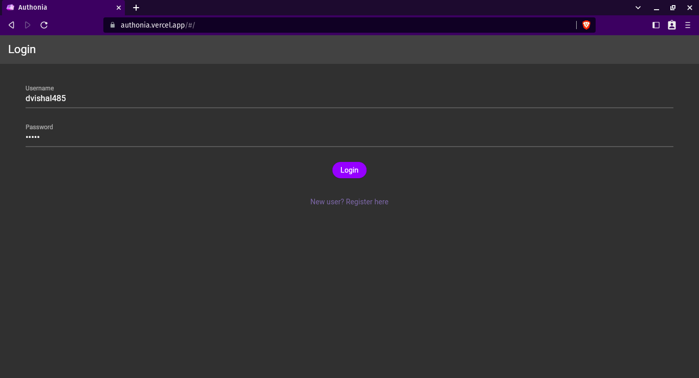
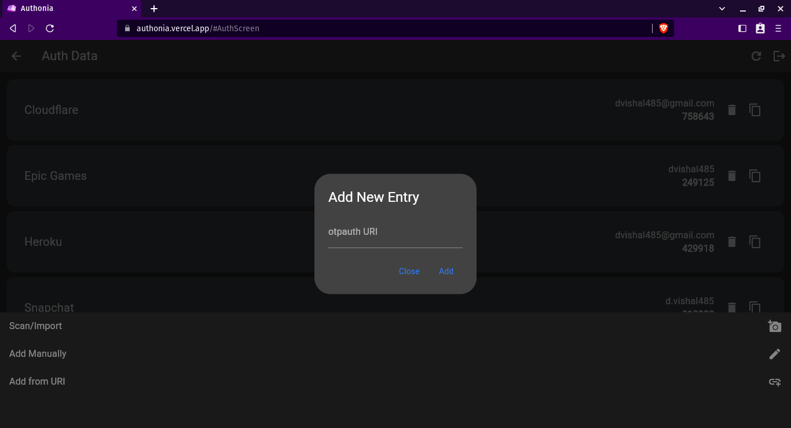
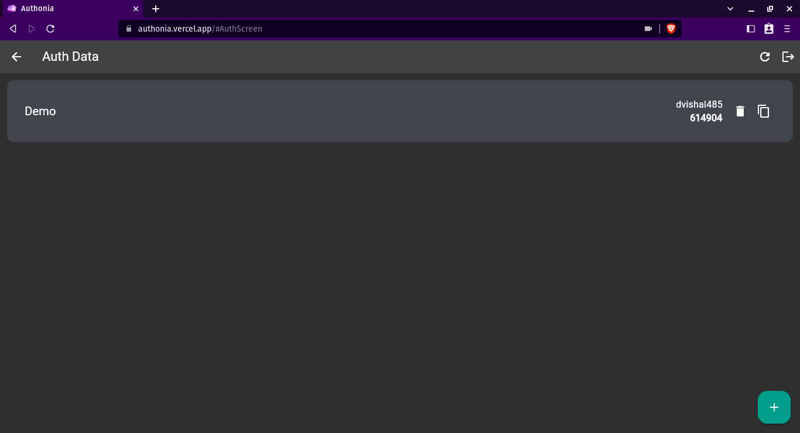
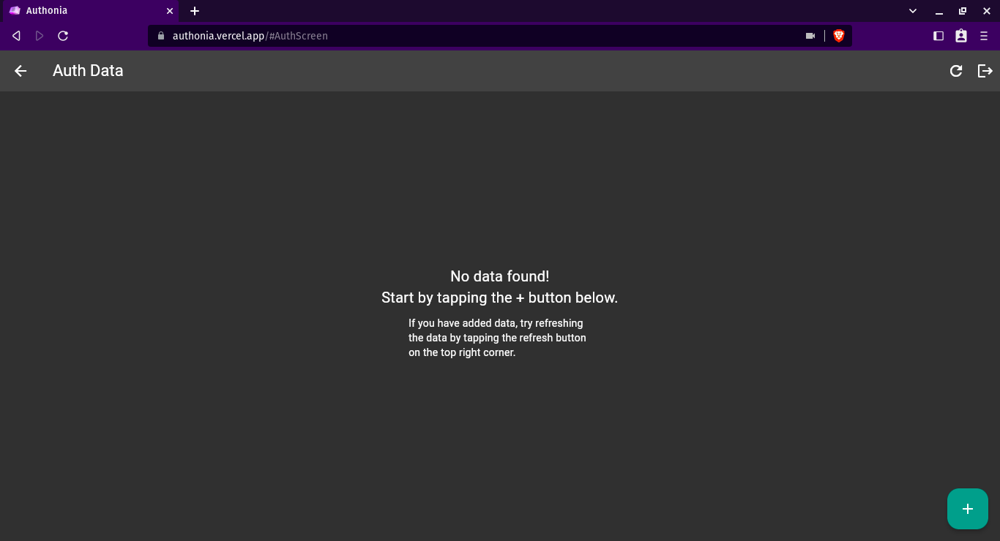
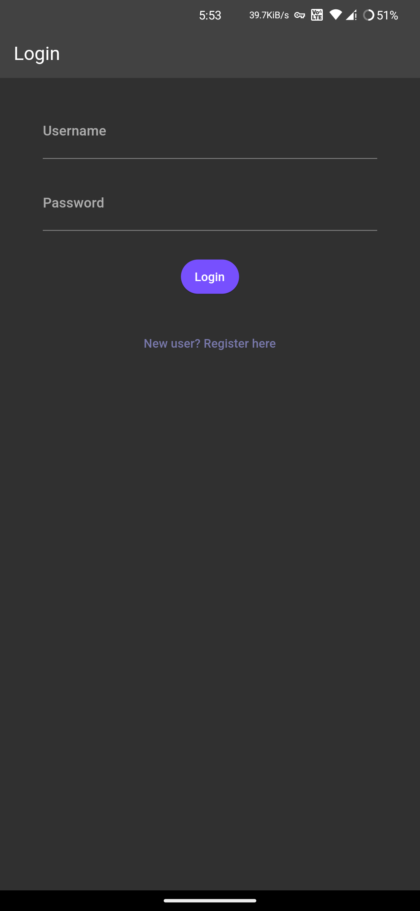
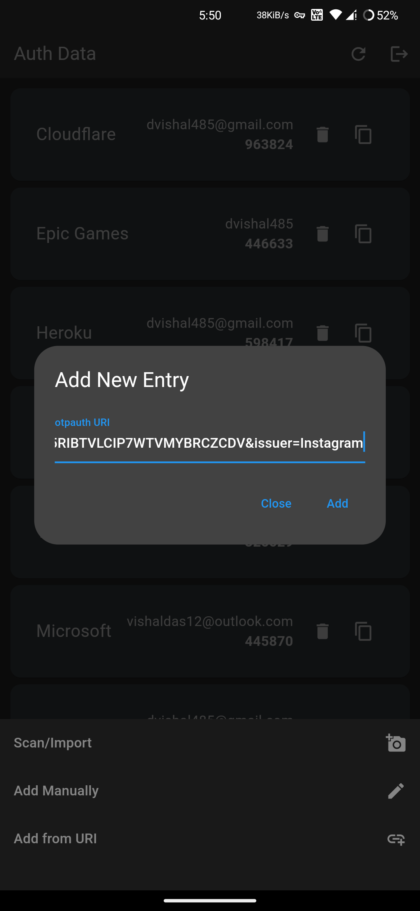
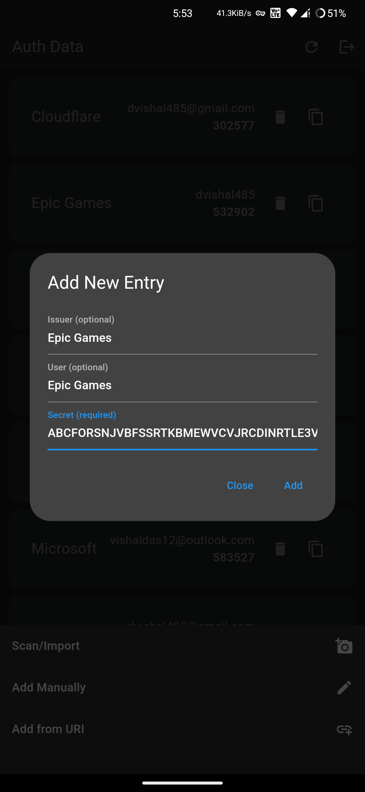

# authonia

A simple cloud 2FA service.

---

## Screenshots

- Web
  
  
  
  

- Mobile
  
  
  
  

---

## Download

- [Android](https://github.com/dvishal485/authonia/releases)
- [Web / PWA](https://authonia.vercel.app)

---

## Dependencies

- http
- crypto
- base32
- shared_preferences
- share_plus
- mobile_scanner

---
